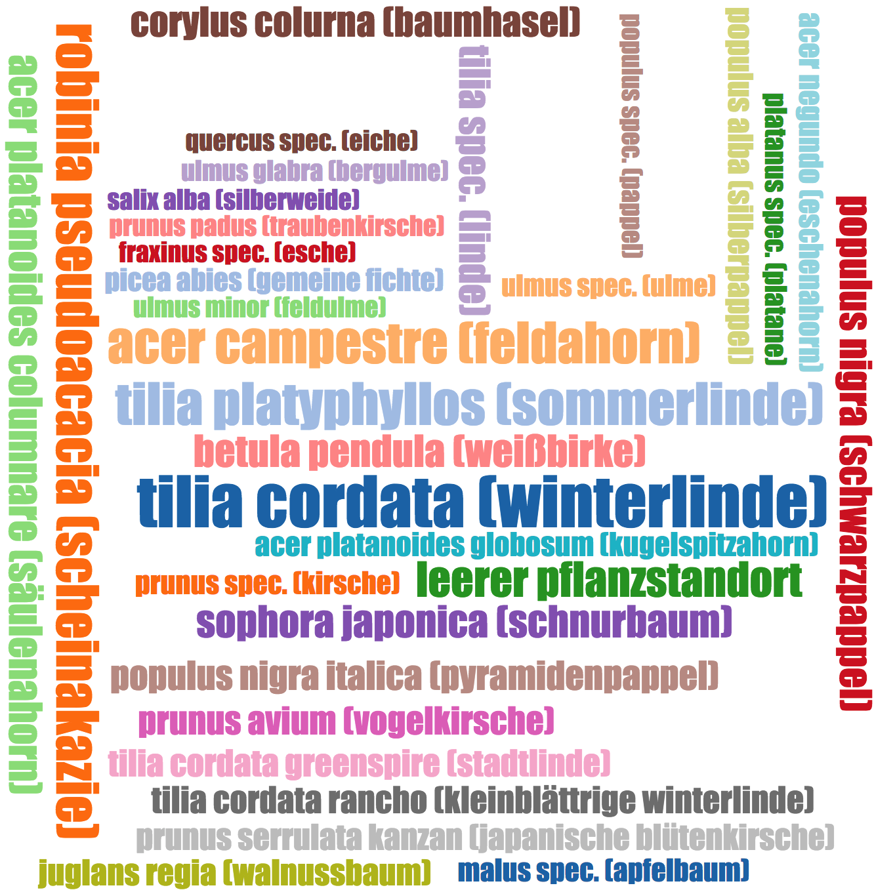

# Python for Everybody Specialization - Capstone project Coursera

**Dataset - Tree Register of Vienna:**
-   data set source: [data.gv.at] (https://data.wien.gv.at/daten/geo?service=WFS&request=GetFeature&version=1.1.0&typeName=ogdwien:BAUMKATOGD&srsName=EPSG:4326&outputFormat=json)
-   published by: 2015-12-15T00:00:00
-   downloaded at: 25 May 2018
-   total features: 199.826 trees

### Tree register or tree locations of Vienna
In addition to trees in streets, the tree register also includes trees in parks and forest-like areas in Vienna. The trees in streets are completely covered, as they serve the MA 42 as a work tool. The trees in parks and forest-like areas, however, are only partially recorded.

### Visualizations

**Tree locations visualised on Google maps**
You can find a map with the trees of the dataset here:
- https://www.florianjosefreheis.com/tree_register_vienna

**Tree species word cloud map based on species frequency**

### Coursera course
[Coursera Python Specialization](https://www.coursera.org/specializations/python)

### Licence
[MIT LICENCE](https://github.com/florianjosefreheis/tree_register_vienna/blob/master/LICENCE)
